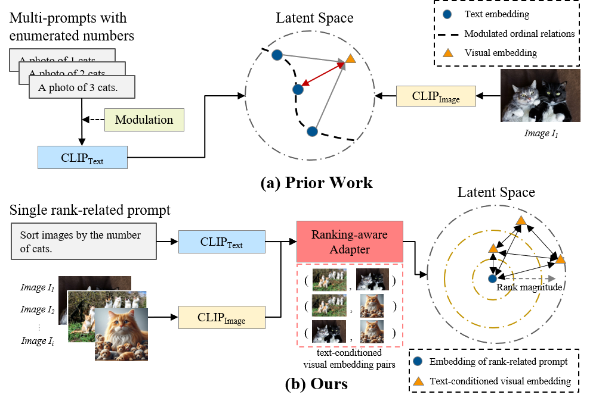
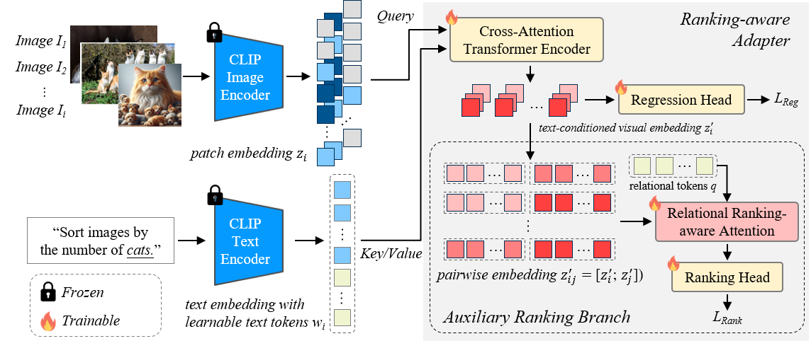
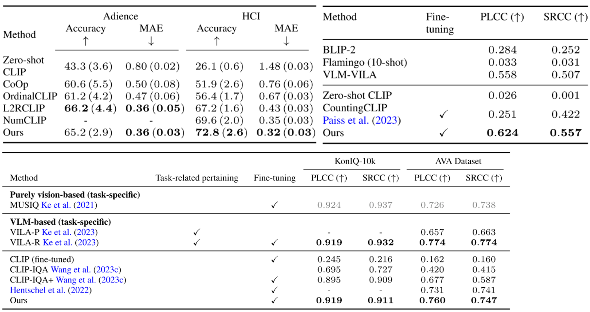

# Ranking-aware adapter for text-driven image ordering with CLIP
---
The official implementation of the paper.

**Ranking-aware Adapter** aims to adapt the pre-trained model for text-guided image ranking. By leveraging a special designed relational attention, we extract the text-conditioned visual distinction from image pairs as an additional supervision for boosting the ranking performance. The results demonstrate that this light-weighted adapter with the ranking-aware module enables a pre-trained CLIP model to support various image ranking tasks across domains, including object count sorting, image quality assessment, and facial age estimation.

[Ranking-aware adapter for text-driven image ordering with CLIP](https://arxiv.org/abs/2412.06760)




## Results


---
## Installation
The repository can be installed via
```
$ poetry install --with cuda
$ poetry run pip install libs/open_clip
```
<NOTE> To run the training code, please follow the setup step as in [OpenCLIP](https://github.com/mlfoundations/open_clip).

## Run Inference
```
$ CUDA_DEVICE_ORDER=PCI_BUS_ID CUDA_VISIBLE_DEVICES=0 poetry run python \
    scripts/inference.py \
    --config-path ./configs/model-config.json \
    --data-to-inference ./examples/example-count-df.csv \
    --checkpoint-path [PATH-TO-CHECKPOINT]
```

## Examples


We provide the simple code to run the inference examples ([demo.ipynb](./demo.ipynb)).

Some pretrained checkpoints can be downloaded.
1. [Object count sorting](https://drive.google.com/file/d/1sX1maP03MiwCeZTHvQvmwkswdnWvjfU2/view?usp=sharing)
2. [Image quality assessment (MOS)](https://drive.google.com/file/d/1H1byD2V5bUwWoHGG7Ih3wYQp4adfa7oh/view?usp=sharing)
3. [Multiple tasks (count, MOS, age, hci)](https://drive.google.com/file/d/11IA5aVDTG_y0ZxXWZJC9vmjeJpC_0Y08/view?usp=sharing)

## Training
Before training the model, the dataset should be prepared as in OpenCLIP format.
```bash
$ poetry run python -m training.main \
    --dataset-type csv \
    --csv-dataset-sample-type rank \
    --negative-ratio 0.2 \
    --train-data <PATH-to-DATASET-CSV> \
    --warmup <WARMUP> \
    --batch-size 5e-5 \
    --wd 0.01 \
    --lock-image \
    --lock-text \
    --epochs <NUM_EPOCHS> \
    --model convnext_large_d_320-adapter \
    --pretrained laion2b_s29b_b131k_ft_soup \
    --loss-opt dual-head \
    --loss-components regression rank
```

## Citation
If you found our work is useful, please consider citing
```
@misc{yu2024rankingawareadaptertextdrivenimage,
      title={Ranking-aware adapter for text-driven image ordering with CLIP},
      author={Wei-Hsiang Yu and Yen-Yu Lin and Ming-Hsuan Yang and Yi-Hsuan Tsai},
      booktitle={The Thirteenth International Conference on Learning Representations},
      year={2025},
}
```

## To do list
The repo is kept updating, stay tuned!
- [x] Inference & Demo code
- [x] Upload checkpoints to public accessible cloud.
- [x] Visualization examples and more details.
- [x] Training code
